# Documentación de Laboratorio 3 

## Michelle Castrillo, Yordi Morales 

Se utilizó el archivo de Estadisticas vino, se encontraron datos nulos en la columna precio y valores en blanco en las la mayoria de las columnas de texto 

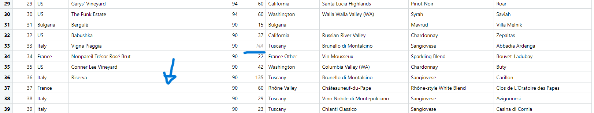

Se encontraron 932 nulos en precio, y las columnas ´Designation´, ´Province´, ´Region_1´, ´Country´ tienen valores en blanco

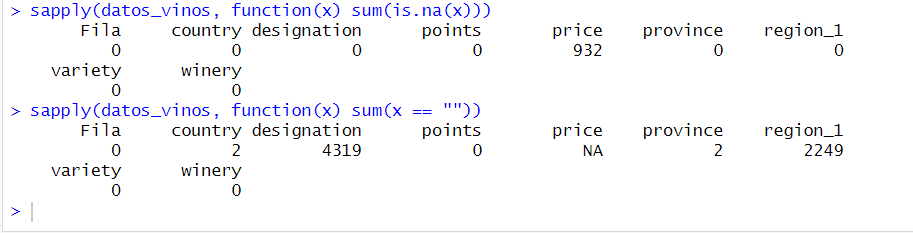

Analisis de la columna precio y puntos

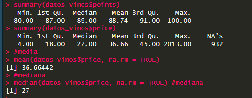

Se cambian los valores en blanco por ´Desconocido´

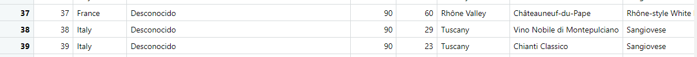

Caja de dispersión de precio con valores nulos y atipicos 

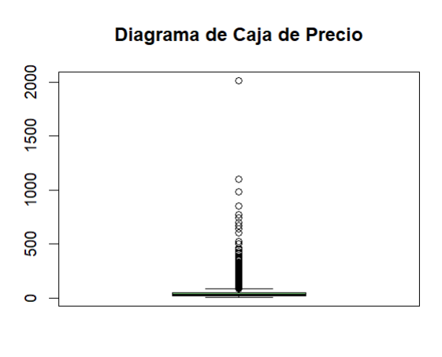

Por tanto, se decide cambiar los valores nulos de precio por la media. A continuación, una caja de dispersión de precio sin valores nulos y con valores atipicos. 

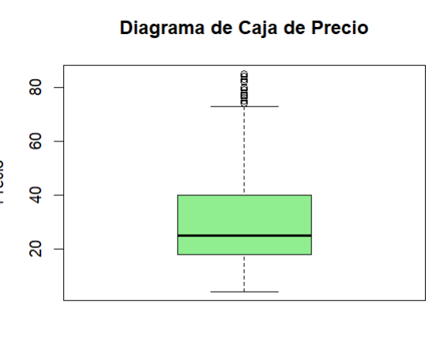

Se eliminan los valores atipicos por el valor del cuartil mas cercano. 

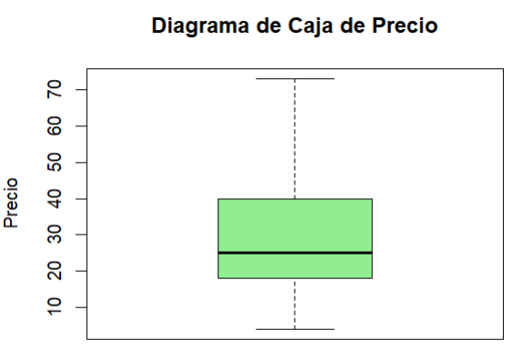

Caja de dispersión de puntos con atipicos 

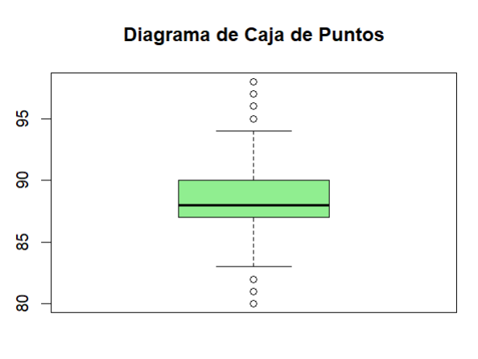

Caja de dispersion de puntos sin atipicos

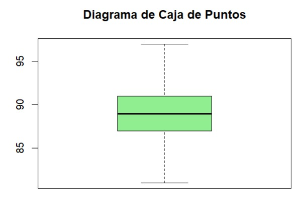

Comparacion de precios por pais de origne

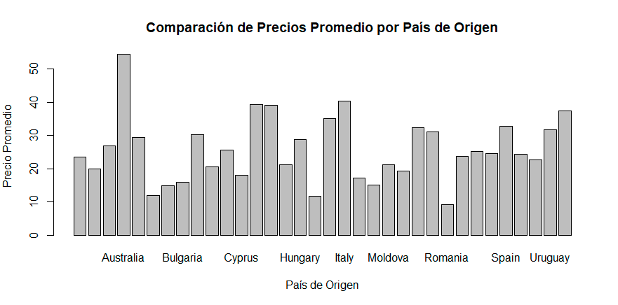

Puntuacion por pais

Se hizo 4 vectores con los 4 datos mas repetitivos de la columna(pais,puntuacion y precio) se llego al analisis de que Italia es el mejor pais en vinos

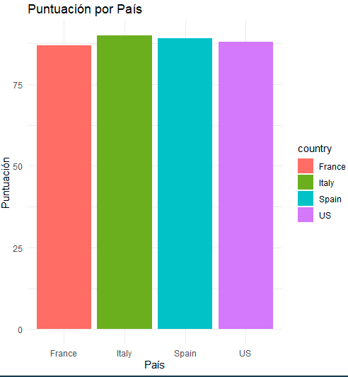

Y con los precios mas altos es Estados Unidos

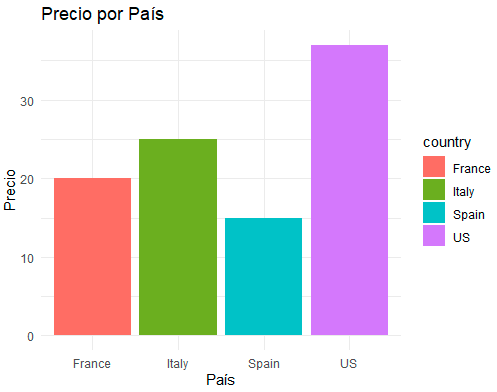
